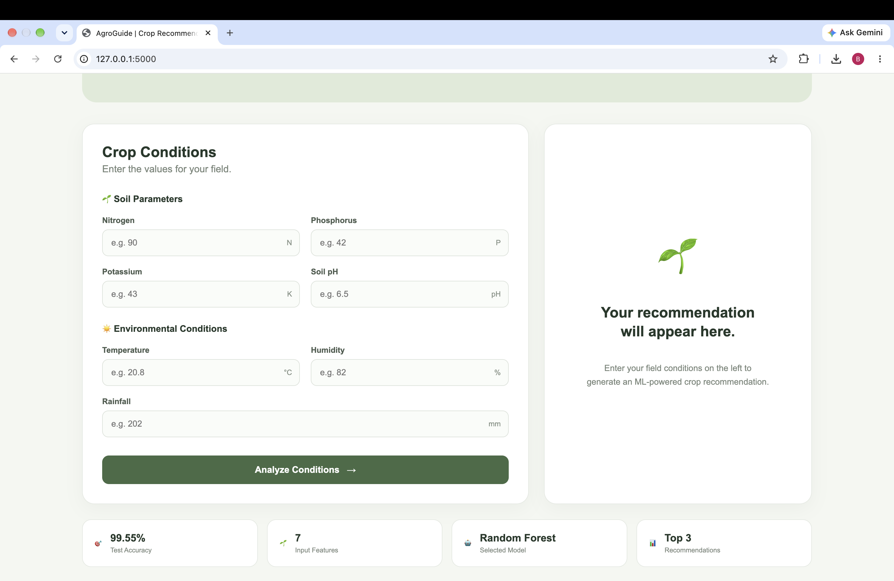
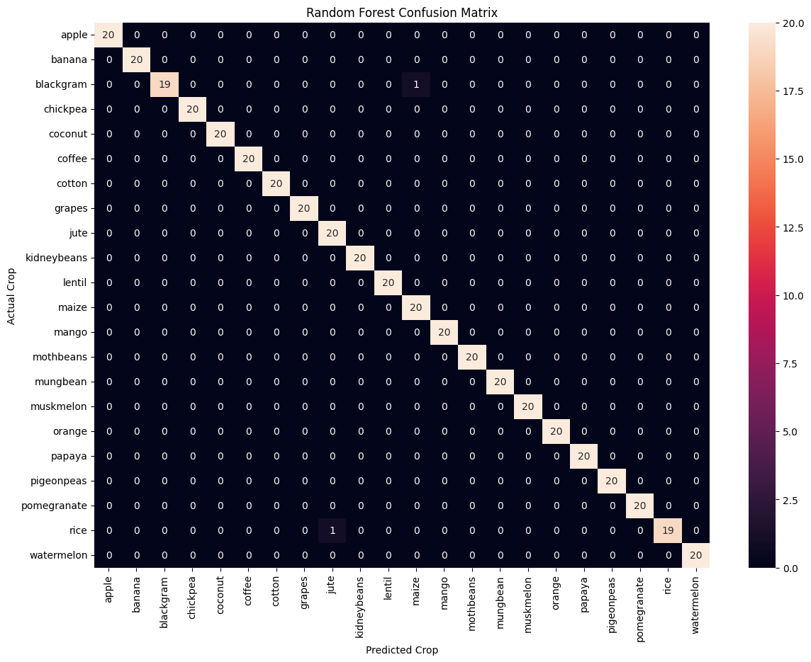
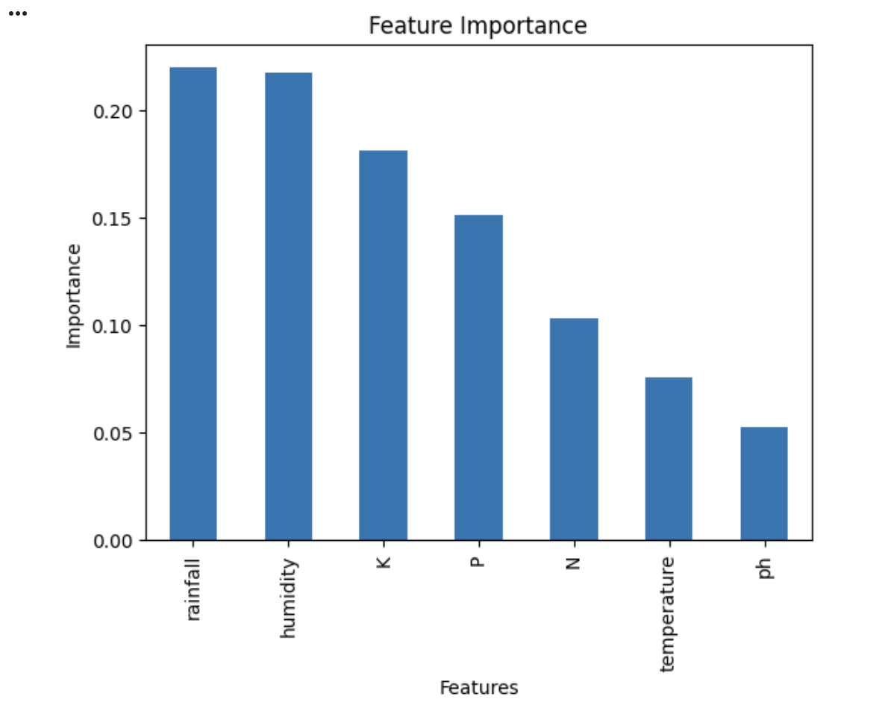

# 🌱 AgroGuide — Crop Recommendation System

AgroGuide is a **machine learning-powered web application** that recommends suitable crops based on soil and environmental conditions.

The project compares multiple classification algorithms, evaluates their performance, and integrates the best-performing model into a **Flask web application**. Users can enter field conditions and receive a crop recommendation along with the model's **top-3 predictions and confidence scores**.

---

## 🖥️ Application Preview



---

## ✨ Features

- 🌱 Crop recommendation based on soil and environmental conditions
- 🤖 Comparison of multiple machine learning classification models
- 🌲 Random Forest selected as the final prediction model
- 📊 Model evaluation using accuracy, precision, recall, and F1-score
- 🔍 Confusion matrix for classification analysis
- 📈 Feature importance analysis
- 🏆 Top-3 crop recommendations using prediction probabilities
- 🎯 Model confidence display
- ⚠️ Input validation for invalid soil and environmental values
- 🌐 Flask-based web interface
- 📱 Responsive user interface
- 💾 Trained model saved using Joblib

---

## 🧠 How It Works

The application follows this pipeline:

```text
User Input
    ↓
Soil & Environmental Parameters
    ↓
Trained Random Forest Model
    ↓
Crop Prediction
    ↓
Prediction Probabilities
    ↓
Top-3 Recommendations
    ↓
Flask Web Interface
```

## 📥 Input Features

The model uses **seven input features**:

| **Feature** | **Description** |
|---|---|
| **Nitrogen (N)** | Nitrogen content in soil |
| **Phosphorus (P)** | Phosphorus content in soil |
| **Potassium (K)** | Potassium content in soil |
| **Temperature** | Environmental temperature |
| **Humidity** | Environmental humidity |
| **Soil pH** | Soil acidity/alkalinity |
| **Rainfall** | Rainfall level |

---

## 🤖 Machine Learning Models

Three classification algorithms were trained and compared:

| **Model** | **Test Accuracy** |
|---|---:|
| Logistic Regression | 97.27% |
| Decision Tree | 97.95% |
| **Random Forest** | **99.55%** |

**Random Forest** was selected as the final model because it achieved the highest test accuracy among the evaluated models.

---

## 📊 Model Evaluation

The machine learning pipeline includes:

- Train/test split
- Stratified sampling
- Accuracy evaluation
- Precision, recall, and F1-score
- Classification report
- Confusion matrix
- Feature importance analysis

The final Random Forest model achieved **99.55% test accuracy** on the evaluation dataset.

> **Note:** The reported accuracy is based on the project's test split and should not be interpreted as real-world agricultural accuracy.

### Confusion Matrix



### Feature Importance



---

## 🌾 Example Prediction

### Example Input

| **Parameter** | **Value** |
|---|---:|
| Nitrogen | 90 |
| Phosphorus | 42 |
| Potassium | 43 |
| Temperature | 20.8°C |
| Humidity | 82% |
| Soil pH | 6.5 |
| Rainfall | 202 mm |

### Result

**Recommended Crop: Rice 🌾**

**Top-3 Model Predictions:**

1. **Rice** — 93.5%
2. **Jute** — 6.5%
3. **Pomegranate** — 0.0%

The percentages represent the **Random Forest model's predicted class probabilities** for this input.

---

## 🖥️ Web Application

The trained model is integrated with **Flask** to provide an interactive web interface.

Users can:

1. Enter soil parameters.
2. Enter environmental conditions.
3. Receive validation feedback for invalid inputs.
4. Submit valid values for prediction.
5. Receive the recommended crop.
6. View the model confidence.
7. View the top-3 predicted crops.

---

## 🛠️ Tech Stack

### Programming & Machine Learning

- **Python**
- **Pandas**
- **NumPy**
- **Scikit-learn**
- **Joblib**

### Web

- **Flask**
- **HTML**
- **CSS**
- **Jinja2**

### Data Analysis & Visualization

- **Matplotlib**
- **Seaborn**

### Development

- **Google Colab**
- **VS Code**
- **Git & GitHub**

---

## 📁 Project Structure

```text
AgroGuide/
│
├── app.py
├── crop_model.pkl
├── requirements.txt
├── README.md
├── .gitignore
│
├── images/
│   ├── agroguide.png
│   ├── confusion_matrix.png
│   └── feature_importance.png
│
├── templates/
│   └── index.html
│
└── static/
    └── style.css
```

---

## 🚀 Running the Project Locally

### 1. Clone the repository

```bash
git clone https://github.com/bhavikakeswani/AgroGuide.git
cd AgroGuide
```

### 2. Create a virtual environment

```bash
python3 -m venv venv
```

### 3. Activate the environment

Mac/Linux:
```bash
source venv/bin/activate
```

Windows:
```bash
venv\Scripts\activate
```

### 4. Install dependencies

```bash
pip install -r requirements.txt
```

### 5. Run the Application

```bash
python app.py
```

### 6. Open the application

Open the following address in your browser:
```bash
http://127.0.0.1:5000
```

---

## 📌 Project Workflow

```text
Dataset
   ↓
Data Preparation
   ↓
Train/Test Split
   ↓
Model Training
   ↓
Model Comparison
   ↓
Model Evaluation
   ↓
Random Forest Selection
   ↓
Feature Importance Analysis
   ↓
Model Serialization with Joblib
   ↓
Flask Integration
   ↓
Input Validation
   ↓
Web-Based Crop Recommendation
```

---

## 🔮 Future Improvements

Possible future enhancements include:

- 🌦️ Real-time weather API integration
- 📜 Prediction history
- 👤 User accounts and saved predictions
- 🌱 Fertilizer recommendations
- 💡 Crop suitability explanations
- 📊 Interactive feature-importance visualizations
- 🌾 Model retraining with larger and more diverse agricultural datasets
- ☁️ Cloud deployment

---

## ⚠️ Disclaimer

AgroGuide is an **educational machine learning project**. Its recommendations are based on patterns learned from the training dataset and should not be treated as professional agricultural advice.

---

## 👩‍💻 Author

**Bhavika Keswani**

Built as a machine learning and web development project to explore the complete workflow from **model training and evaluation to web application development**.
